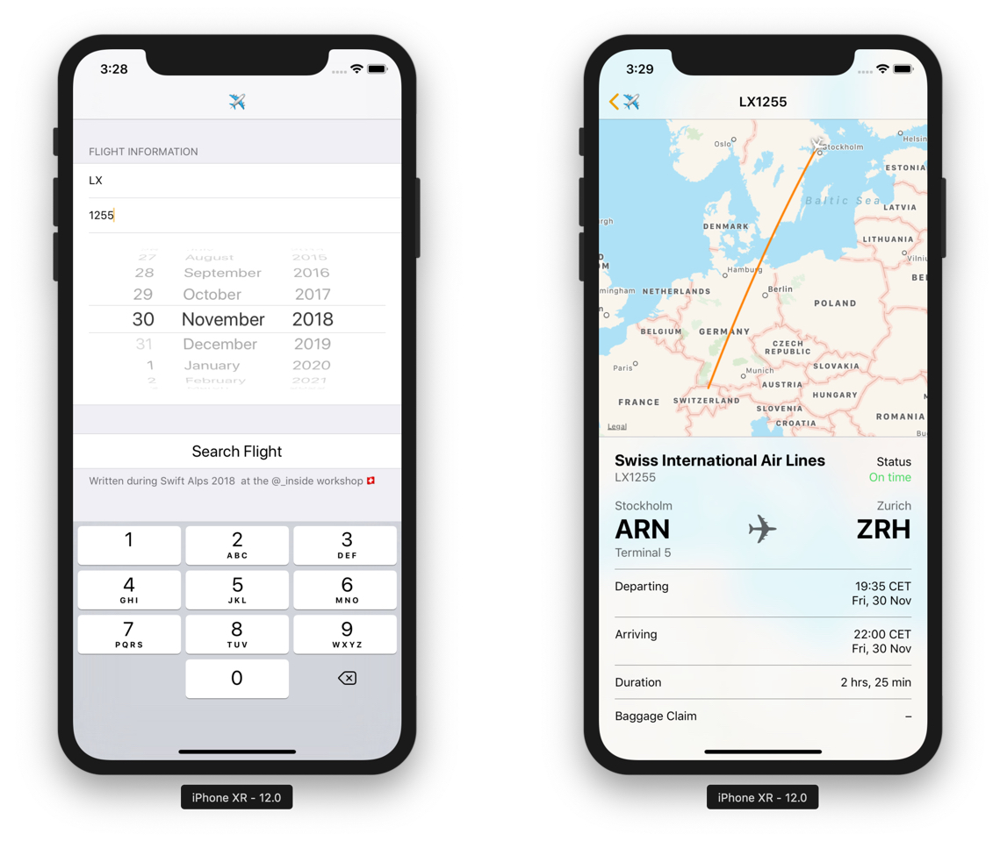

# FlightUtilities

A small app that uses the private `FlightUtilities.framework` to show information about any flight given the airline code, flight code and date.

Built during [@_inside](https://twitter.com/_inside) workshop about reverse engineering at [The Swift Alps 2018](https://theswiftalps.com). Feel free to install on your device.
